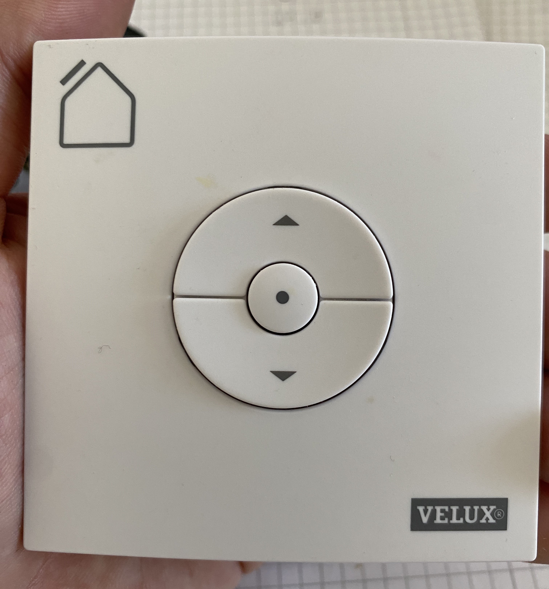
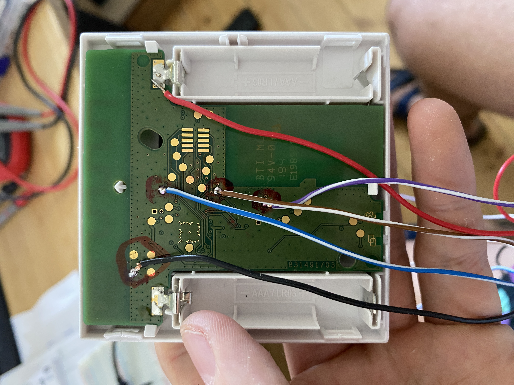
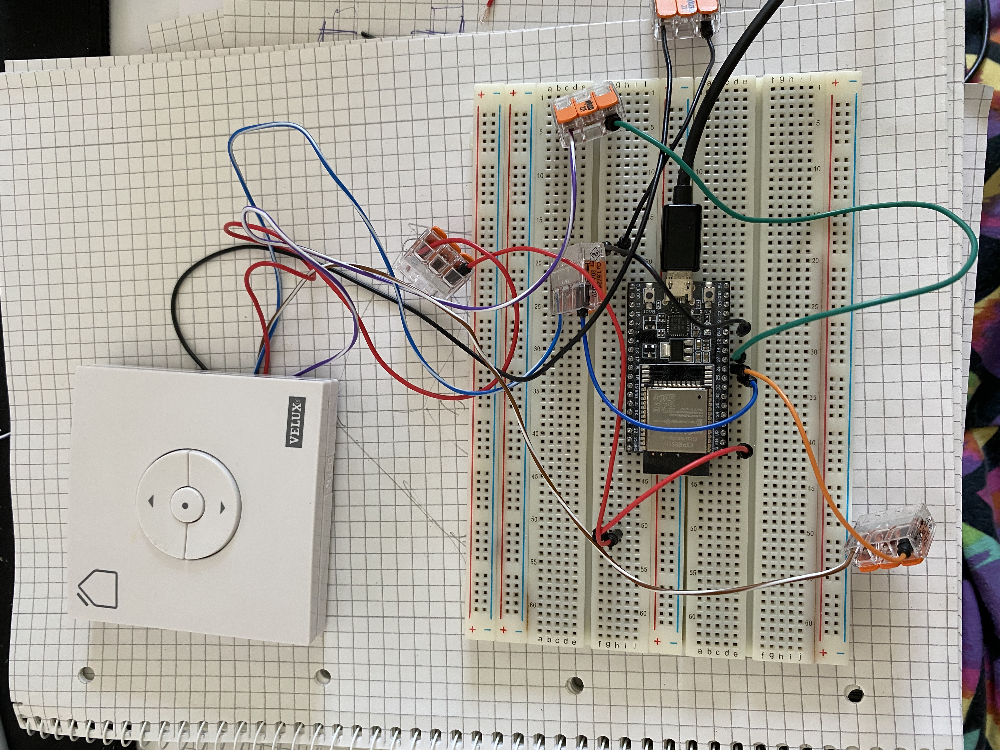

# ESPhome for Velux 3LI D13
This is an open source project for converting a Velux 3LI remote into a smart home compatible device. The remote is paired over a closed wireless protocol with a Velux roller shutter.

This approach emulates a button press on the remote directly. The regular buttons are still working. The alternative is to get a 150€/$ relay KLF 200.

## 1. Velux 3LI D13



The remote is using 3 buttons to control the shutter. It is powered by two 1.5 V batteries. 



We can open the remote and connect 5 cables to handily available pcb test points on the back of the pcb. They connect to the following signals on the PCB:

- Black: for GND
- Red: for 3V
- Blue / Brown / Purple: To the µc pins of the 3 buttons.

The 3 buttons do usually switch the µc pin to gnd as soon as pressed.

# 2. ESPhome

I had a ESP32 dev board lying around since 2 years which seemed perfect for this project. 



See https://esphome.io/ for a guide on how to flash your device. See `smartvelux.yaml` for the configuration. Note: the yaml file does not include the wifi credentials, these are stored in a `secrets.yaml` file which needs to be created individually:

```yaml
wifi_ssid: "your wifi ssid (with quotes)"
wifi_password: "your wifi password (with quotes)"
```

# 3. Housing

The housing consists of 2 3d printed parts. Additional things needed:
- 2 mm damping foam rubber, or similar, or nothing (adjust spacing in this case)
- 4x M3 heat press insert
- 4x M3 countersunk head screws

